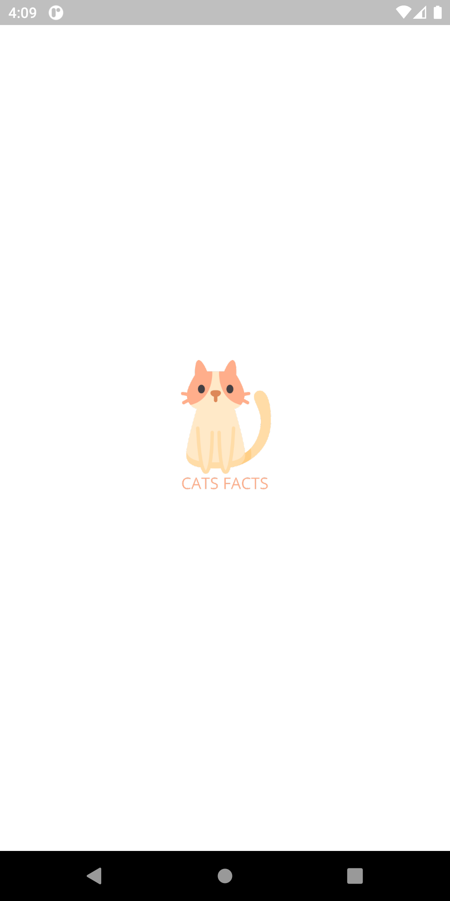
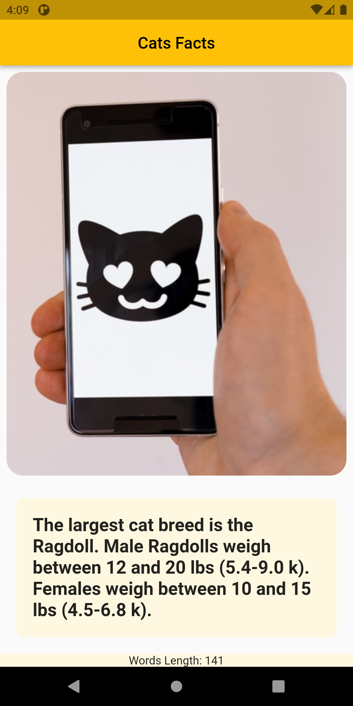

# cats_facts

A new Flutter project. Cats Facts (API Intigration)

## Screenshots
&nbsp;

## Getting Started

Adding new line for commit check

For help getting started with Flutter, view our
[online documentation](https://flutter.dev/docs), which offers tutorials,
samples, guidance on mobile development, and a full API reference.
